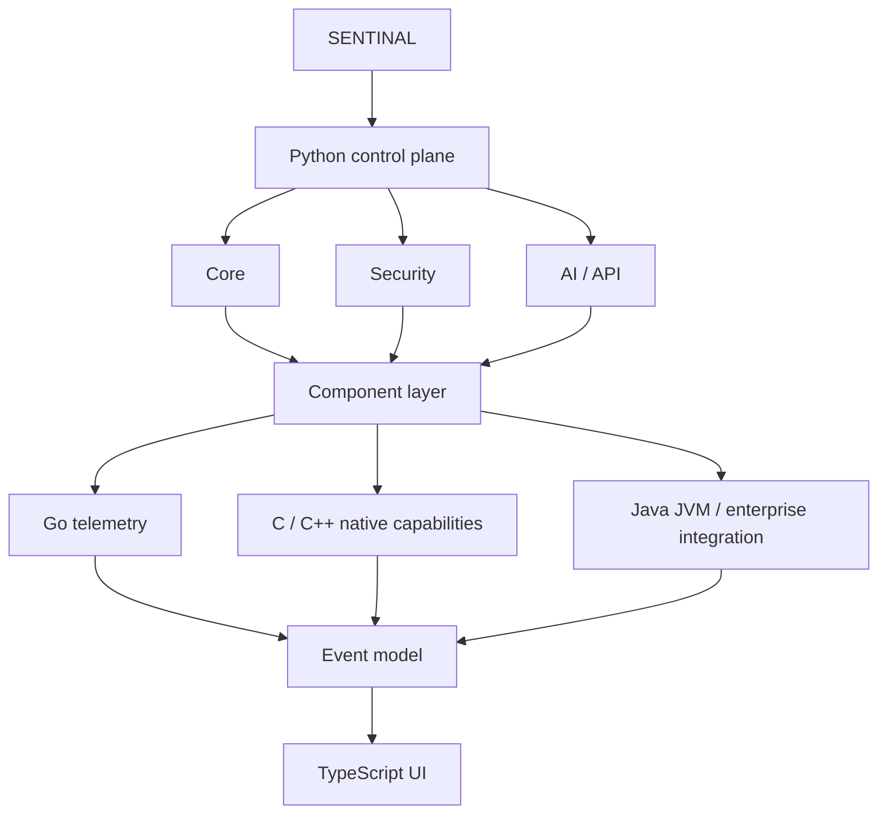

# SENTINAL

> Intelligent Security & System Monitoring Platform

[](LICENSE) [](pyproject.toml)

Created and maintained by **Valcor-01** · Version **0.1.0** · Status: **Phase 1.5 application foundation**

SENTINAL is a modular, defensive platform for observing and analyzing system telemetry, processes, network activity, and normalized security events. It is being built for clear local visibility, structured APIs, dashboards, and extensible monitoring components.

**SENTINAL observes and analyzes. AI explains and assists. Sensitive actions remain controlled by the user.**

## Current scope

This repository provides a small Flask application foundation: validated settings, structured logging, lifecycle ownership, a local SQLite metadata database, request correlation, and a readiness endpoint. System Intelligence, telemetry collectors, monitoring engines, dashboard, AI, and security analysis remain planned—not present functionality.

## Intended capabilities

| Area | Planned capabilities |
| --- | --- |
| System intelligence | CPU, memory, storage, OS, uptime, process data, snapshots |
| Security | observations, process analysis, integrity and permission indicators, risk assessment |
| Network | interfaces, connections, sockets, DNS, network and service observations |
| Events | collection, normalization, classification, severity, timelines, structured storage |
| Intelligence | explanations, summaries, recommendations, optional provider abstractions and local AI |
| Interface | REST API, CLI, web dashboard, real-time telemetry, charts, visualizations |

## Architecture



The intended polyglot architecture uses Python for the control plane, TypeScript/HTML/CSS for the web dashboard, Go for performance-sensitive telemetry, C/C++ for native work, Java for JVM integration, and SQLite as the initial local database. Components will use only the languages they need.

## Requirements and installation

Runtime support requires Python 3.11+. The foundation is validated locally with Python 3.14.7. Go, native, Java, and frontend requirements are intentionally not prescribed until those components exist and are tested.

```powershell
git clone https://github.com/Valcor-01/SENTINAL.git
cd SENTINAL
python -m venv .venv
.\.venv\Scripts\Activate.ps1
python -m pip install --upgrade pip
python -m pip install -e ".[dev]"
Copy-Item .env.example .env
pytest
ruff check .
python app.py
```

The application listens on `http://127.0.0.1:8000` by default. Check readiness with `GET /api/health`. SQLite initialization creates only `app_metadata`; telemetry and event storage do not exist yet.

## Configuration

Copy `.env.example` to `.env`. `SENTINAL_ENV`, `HOST`, `PORT`, `DEBUG`, `DATABASE_PATH`, and `LOG_LEVEL` are validated at startup. Never commit `.env`, API keys, passwords, tokens, or private certificates. See [docs/DEVELOPMENT.md](docs/DEVELOPMENT.md) and [PRIVACY.md](PRIVACY.md).

## Development

See [CONTRIBUTING.md](CONTRIBUTING.md), [SECURITY.md](SECURITY.md), [docs/PROJECT_MAP.md](docs/PROJECT_MAP.md), and [ROADMAP.md](ROADMAP.md). This project is licensed under the [MIT License](LICENSE). The license is suitable for this dependency-free scaffold; reassess compatibility as dependencies or copied components are introduced.

## Project identity

| Field | Value |
| --- | --- |
| Project | SENTINAL |
| Author | Valcor-01 |
| Principle | Observe → Analyze → Assess → Explain → Recommend |
| Security posture | Defensive, read-only by default, least privilege, explicit user control |
